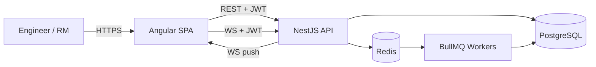
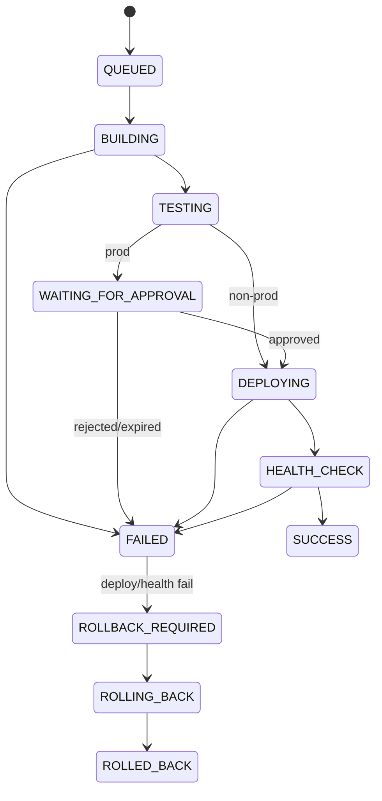
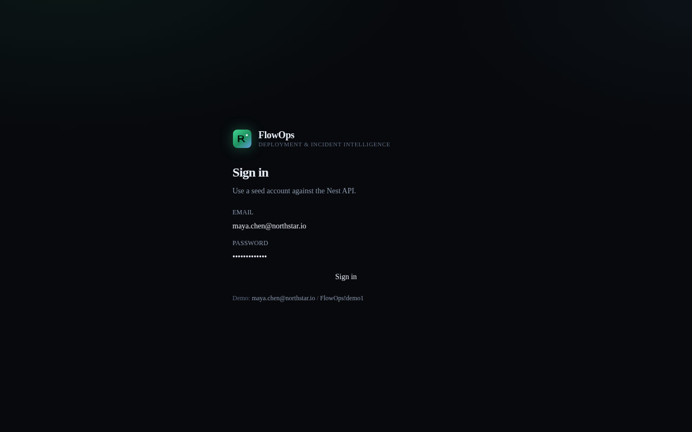
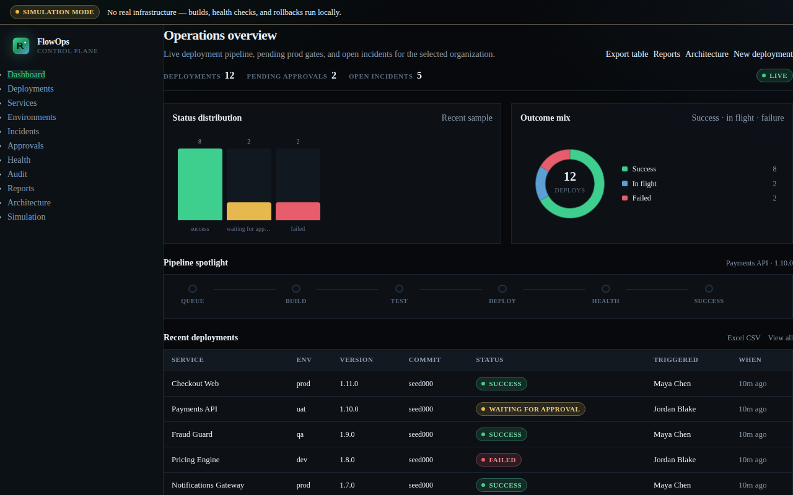
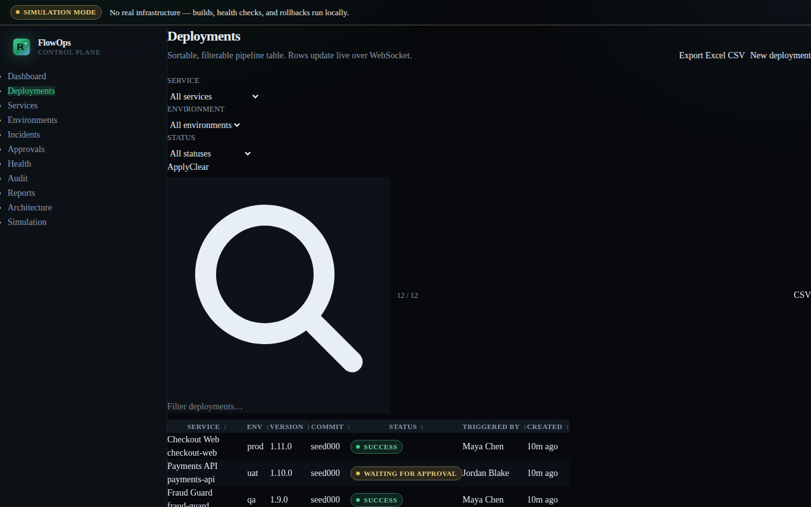
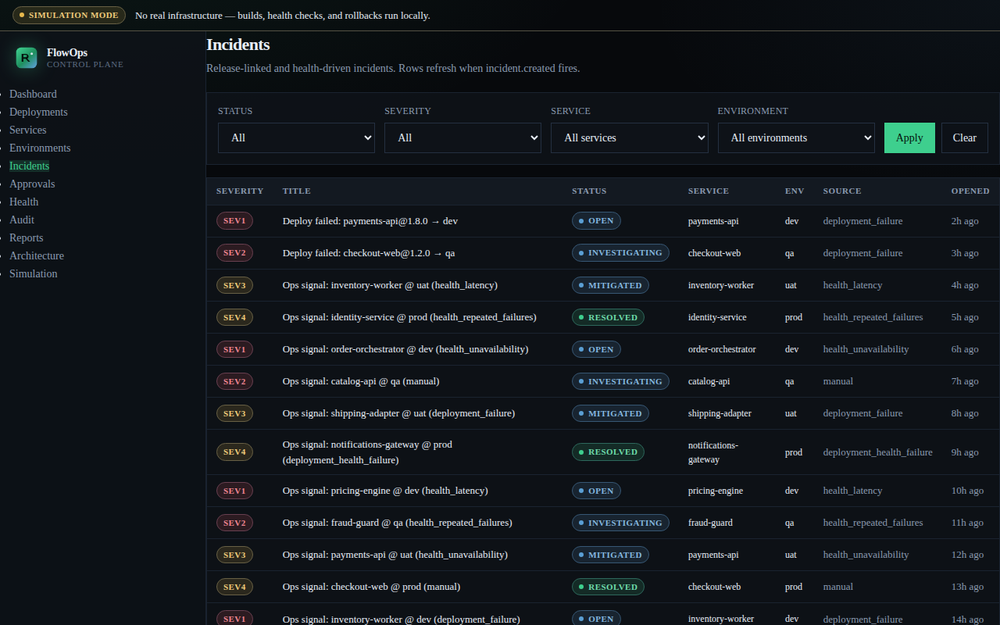

# FlowOps

**Production Deployment & Incident Intelligence Platform**

A portfolio flagship that models how engineering teams **ship, approve, observe, and recover** from deployments — with a serious dark-first ops UI and a full local simulation engine.

> **Simulation-first:** FlowOps does **not** deploy to real cloud infrastructure. Builds, health checks, and rollbacks run locally via BullMQ workers so the entire product is demoable with one Docker Compose command.

[](./.github/workflows/ci.yml)
[](#stack)
[](./LICENSE)

---

## Table of contents

1. [Overview](#overview)
2. [Problem](#problem)
3. [Features](#features)
4. [Architecture](#architecture)
5. [Stack](#stack)
6. [Quick start](#quick-start-docker-compose)
7. [Environment variables](#environment-variables)
8. [Local development](#local-development-without-compose)
9. [API](#api)
10. [Testing](#testing)
11. [CI / CD](#ci--cd)
12. [Design decisions](#design-decisions)
13. [Screenshots](#screenshots)
14. [Documentation map](#documentation-map)
15. [Future work](#future-work)
16. [License](#license)

---

## Overview

FlowOps is an end-to-end **deployment control plane** for a fictional org (**Northstar**): multi-role RBAC, production approvals, simulated pipelines, auto-incidents, rollbacks, audit trails, and live WebSocket updates — packaged so a recruiter opening GitHub can immediately see senior engineering judgment (boundaries, docs, tests, Docker, security notes).

**Status:** Milestones **M1–M14 complete** on branch `cursor/flowops-m12-docker-ci-274a`.

---

## Problem

Shipping software in production orgs is not “push and pray.” Teams need:

- A clear **deployment lifecycle** with failure and rollback paths  
- **Production gates** (approvals) with accountable actors  
- **Incidents** tied to failed releases, not tribal Slack knowledge  
- **Auditability** for forensics and compliance storytelling  
- A UI operators will actually use under pressure  

Most portfolio apps stop at CRUD. FlowOps models the **control plane** — honestly simulated, fully runnable locally.

---

## Features

| Area | What you get |
|------|----------------|
| Auth & RBAC | JWT + refresh (argon2), org membership roles: Admin · DevOps · Developer · Release Manager · Viewer |
| Catalog | Services, environments (Dev/QA/UAT/Prod), teams |
| Deployments | Full state machine, filters, pagination, event timeline, pipeline visualization |
| Approvals | Prod waiting-room with TTL expiry, decide + audit |
| Health | Simulated probes + service health board |
| Incidents | Auto-create on deploy/health failure; resolve path |
| Rollback | Local simulation from `ROLLBACK_REQUIRED` |
| Audit | Append-only explorer |
| Realtime | Socket.IO `/ws` — deployment & incident updates |
| Simulation | Admin/DevOps knobs + scenario runners |
| Reports | Charts + Excel/CSV export |
| Delivery | Multi-stage Docker images · Compose one-shot seed · GH Actions CI/CD simulation |

---

## Architecture





Compose topology and ADRs: [docs/ARCHITECTURE.md](./docs/ARCHITECTURE.md).

---

## Stack

| Layer | Choice |
|-------|--------|
| Frontend | Angular 20 · Tailwind 4 · DaisyUI · Angular CDK (`apps/web`) |
| API | NestJS 11 modular monolith (`apps/api`) |
| ORM / DB | Prisma 5 · PostgreSQL 16 |
| Jobs / realtime | Redis · BullMQ · Socket.IO `/ws` |
| Delivery | Docker Compose · GitHub Actions |
| Tests | Jest (API) · Karma/Jasmine (web) · Playwright E2E |

---

## Quick start (Docker Compose)

```bash
git clone <repo-url> && cd <repo>
cp .env.example .env   # optional — defaults work for local demo
docker compose up --build
# or: ./scripts/compose-up.sh
```

| Surface | URL |
|---------|-----|
| Web | http://127.0.0.1:43125 |
| API | http://127.0.0.1:43124/api/v1 |

**Demo login:** `maya.chen@northstar.io` / `FlowOps!demo1`

Stop: `docker compose down` (add `-v` to wipe Postgres volume).

Postgres/Redis stay on the Compose network only (no host publish) to avoid clashing with local `5432`/`6379`.

---

## Environment variables

Root `.env` (Compose overrides) and `apps/api/.env` (local API) share the same knobs. See [`.env.example`](./.env.example) and [`apps/api/.env.example`](./apps/api/.env.example).

| Variable | Purpose | Default / notes |
|----------|---------|-----------------|
| `DATABASE_URL` | Postgres connection | Compose: `postgres:5432` |
| `REDIS_URL` | Redis for BullMQ + caches | Compose: `redis:6379` |
| `JWT_ACCESS_SECRET` | Access token signing (≥32 chars) | Demo secret in examples |
| `JWT_REFRESH_SECRET` | Refresh token hashing salt (≥32) | Demo secret in examples |
| `JWT_ACCESS_TTL` / `JWT_REFRESH_TTL` | Token lifetimes | `15m` / `7d` |
| `CORS_ORIGIN` | Comma-separated SPA origins | Required allowlist in production |
| `PORT` / `API_PREFIX` | HTTP bind | `43124` / `api/v1` |
| `THROTTLE_TTL_MS` / `THROTTLE_LIMIT` | Global rate limit | `60000` / `100` |
| `SIM_*` | Simulation delays & fail rates | Safe zeros for happy-path demos |
| `APPROVAL_TTL_HOURS` | Prod approval window | `24` |
| `RUN_SEED` | Compose API entrypoint seed | `true` on api service |

---

## Local development (without Compose)

### API

Requires PostgreSQL **and** Redis.

```bash
cd apps/api
cp .env.example .env
npm ci
npx prisma migrate deploy
npx prisma db seed
npm run start:dev
# optional discrete worker:
npm run start:worker
```

### Web

```bash
cd apps/web
npm ci
npm start
```

### Seed accounts

| Email | Password | Role |
|-------|----------|------|
| `maya.chen@northstar.io` | `FlowOps!demo1` | admin |
| `jordan.blake@northstar.io` | `FlowOps!demo1` | devops |
| `avery.kim@northstar.io` | `FlowOps!demo1` | release_manager |

---

## API

Base path: `/api/v1` · Auth: `Authorization: Bearer <accessToken>` · Org context: `X-Org-Id` header.

Quick index and examples: **[API.md](./API.md)** · Full contract: **[docs/API_SPEC.md](./docs/API_SPEC.md)**

```bash
curl -s -X POST http://127.0.0.1:43124/api/v1/auth/login \
  -H 'Content-Type: application/json' \
  -d '{"email":"maya.chen@northstar.io","password":"FlowOps!demo1"}'
```

---

## Testing

```bash
# API unit / integration
cd apps/api && npm test
cd apps/api && npm test -- --coverage

# Live API e2e (API + Postgres + Redis running)
cd apps/api && RUN_E2E=1 npm run test:e2e

# Web unit + Playwright (web + API running)
cd apps/web && npm test
cd apps/web && npm run test:e2e
```

---

## CI / CD

| Workflow | What it does |
|----------|----------------|
| [`.github/workflows/ci.yml`](./.github/workflows/ci.yml) | Secret scan · install · lint · unit test · build |
| [`.github/workflows/cd-simulate.yml`](./.github/workflows/cd-simulate.yml) | Build/tag Docker images · upload `.tar.gz` artifacts (no paid registry) |

---

## Design decisions

| Decision | Why |
|----------|-----|
| Modular NestJS monolith + discrete worker | Portfolio-scale complexity without microservices tax |
| BullMQ simulation pipeline | Durable stages that map to real deploy mental models |
| Simulation-first | Fully demoable; honest about not touching real infra |
| Org-scoped multi-tenancy + RBAC | Realistic SaaS boundary |
| Append-only audit + deployment events | Forensics-friendly timelines |
| Ignore JWT `role` claims server-side | Membership (DB/cache) is source of truth |
| Short-TTL Redis membership/env caches | Cut guard/list latency without weakening authz |

More: [docs/ARCHITECTURE.md](./docs/ARCHITECTURE.md) ADRs · [SECURITY.md](./SECURITY.md)

---

## Screenshots

Place captures under [`docs/screenshots/`](./docs/screenshots/). If images are present they render below; otherwise run the app and drop PNGs with the listed names.

| | |
|:--|:--|
|  |  |
|  |  |

---

## Documentation map

| Document | Contents |
|----------|----------|
| [API.md](./API.md) | Recruiter-friendly API index |
| [CONTRIBUTING.md](./CONTRIBUTING.md) | Dev setup, commits, PR checklist |
| [SECURITY.md](./SECURITY.md) | Threat model + hardening checklist |
| [docs/PRODUCT_SPEC.md](./docs/PRODUCT_SPEC.md) | Problem, personas, modules, flows |
| [docs/ARCHITECTURE.md](./docs/ARCHITECTURE.md) | System context, modules, ADRs |
| [docs/DATABASE_DESIGN.md](./docs/DATABASE_DESIGN.md) | Schema, indexes, Mermaid ERD |
| [docs/API_SPEC.md](./docs/API_SPEC.md) | Full REST + WS + RBAC matrix |
| [docs/IMPLEMENTATION_PLAN.md](./docs/IMPLEMENTATION_PLAN.md) | M1–M14 exit criteria |

---

## Future work

Honest backlog (not claimed as shipped):

- SSO / MFA and finer-grained team-scoped permissions  
- Real artifact registries and cloud deploy adapters (behind feature flags)  
- Horizontally scaled WS fan-out with Redis adapter under load tests  
- OpenAPI generation published from Nest decorators  
- Dark/light theme polish pass + denser mobile ops layouts  

---

## License

[MIT](./LICENSE)
