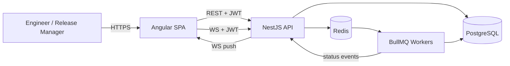
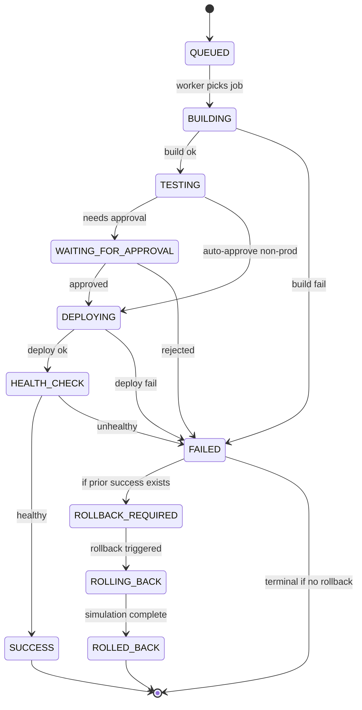
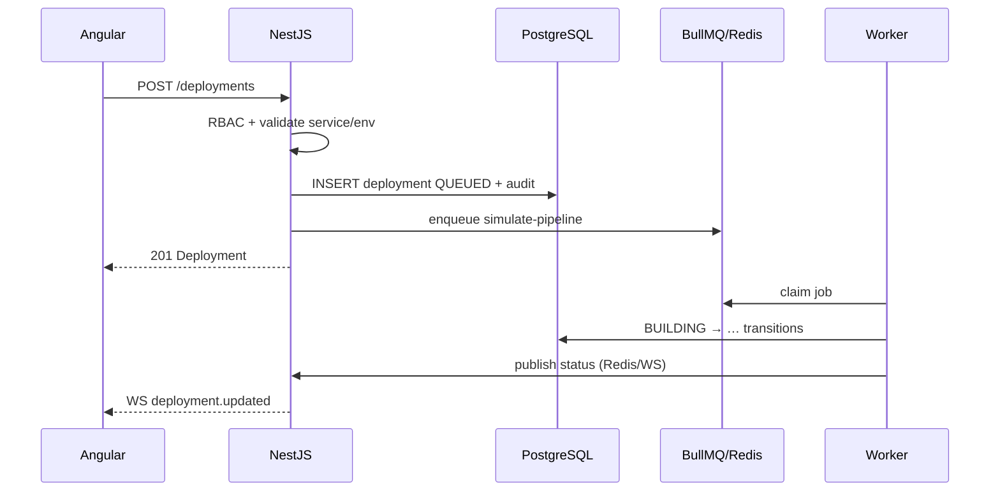
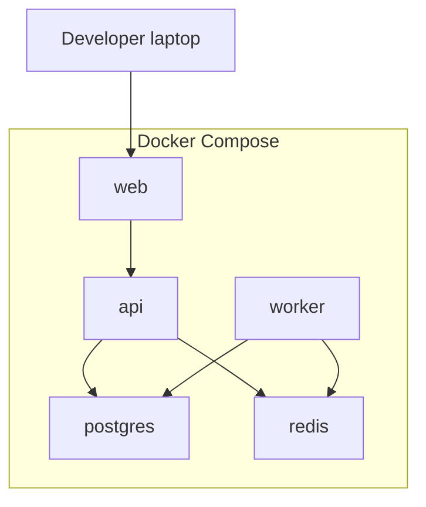

# FlowOps — Architecture

**Stack:** Angular 20+ · NestJS · PostgreSQL · Redis · BullMQ · WebSockets · Docker Compose · GitHub Actions · Jest · Playwright

---

## 1. System Context



FlowOps is a **modular monolith**: one NestJS process hosts HTTP, WebSocket gateway, and (in Compose) worker processes share the same codebase. Redis backs BullMQ job queues and optional pub/sub for multi-process WS fan-out.

---

## 2. High-Level Components

| Component | Responsibility |
|-----------|----------------|
| **web** (`apps/web`) | Angular SPA — dashboards, deploy wizard, incidents, audit |
| **api** (`apps/api`) | NestJS REST + WS gateway, auth, domain modules |
| **worker** (`apps/api` worker entry) | BullMQ processors: build/test/deploy/health/rollback simulation |
| **postgres** | System of record |
| **redis** | Job queue + ephemeral pub/sub |
| **caddy/nginx** (optional later) | TLS termination in Compose profiles |

---

## 3. NestJS Module Map

Aligned with domain boundaries (SOLID / modular NestJS):

```
apps/api/src/
  modules/
    auth/
    users/
    organizations/
    teams/
    services/
    environments/
    deployments/
    approvals/
    health/
    incidents/
    rollback/
    audit/
    notifications/
    simulation/
  common/          # guards, filters, interceptors, pagination, logging
  config/
  database/
```

**Rules**

- Controllers are thin: validate → call service → map DTO  
- Domain services own state transitions (deployments never jump states ad-hoc)  
- Cross-cutting: `AuditService`, `NotificationsService`, WS gateway events  
- Simulation logic lives in `simulation/` + worker processors — never in controllers  

---

## 4. Deployment State Machine



**Invariants**

1. Transitions are validated server-side against an allow-list matrix.  
2. Every transition writes: `deployment_events` row + `audit_logs` row + WS event.  
3. Prod (`requires_approval`) must pass through `WAITING_FOR_APPROVAL`.  
4. Rollback is only available from `ROLLBACK_REQUIRED` (or Admin force — documented exception).  

---

## 5. Runtime Flows

### 5.1 Create deployment



### 5.2 Production approval

1. Worker pauses at `WAITING_FOR_APPROVAL`, emits notification.  
2. Release Manager `POST /approvals/:id/decide`.  
3. On approve, API enqueues `continue-deploy` job; on reject, marks `FAILED` + incident policy.

---

## 6. AuthN / AuthZ

| Concern | Approach |
|---------|----------|
| Access token | JWT (short TTL, e.g. 15m), `Authorization: Bearer` |
| Refresh token | Opaque token hashed at rest; rotate on use |
| Password | argon2id |
| Guards | `JwtAuthGuard` + `RolesGuard` + org membership check |
| WS | JWT via connection query/header; join `org:{id}` rooms |

RBAC is evaluated per request with `(userId, orgId, role)`. Resource ownership (team ↔ service) may further restrict Developers.

---

## 7. Data & Caching

- **PostgreSQL** is source of truth (see [DATABASE_DESIGN.md](./DATABASE_DESIGN.md)).  
- **Redis** is not a cache of business entities in M1–M12 default design — queue + pub/sub only.  
- List endpoints: cursor or offset pagination, filter, sort (indexed columns).  

---

## 8. Real-time

- NestJS `@WebSocketGateway` with Socket.IO (or ws)  
- Rooms: `org:{orgId}`, `deployment:{id}`, `incident:{id}`  
- Event names: `deployment.updated`, `approval.requested`, `incident.created`, `incident.updated`  
- Clients refetch or apply patch payloads (prefer small status DTOs)

---

## 9. Simulation Engine

Configurable knobs (env / org settings):

| Knob | Default | Effect |
|------|---------|--------|
| `SIM_BUILD_FAIL_RATE` | 0.05 | BUILDING → FAILED |
| `SIM_DEPLOY_FAIL_RATE` | 0.08 | DEPLOYING → FAILED |
| `SIM_HEALTH_FAIL_RATE` | 0.10 | HEALTH_CHECK → FAILED |
| Stage delays | 1–3s | Realistic timeline without long waits |

Workers use seeded RNG per deployment id for reproducible demos when `SIM_DETERMINISTIC=true`.

---

## 10. Observability & Ops

- Structured logs: `level`, `msg`, `requestId`, `orgId`, `userId`, `deploymentId`  
- HTTP `GET /health/live`, `GET /health/ready` (DB + Redis)  
- Worker heartbeat logged; failed jobs → BullMQ retries with backoff then dead-letter visibility in admin UI (later milestone)  

---

## 11. Security Architecture

- Secrets via environment variables; Compose uses `.env` gitignored  
- Helmet, CORS allowlist for SPA origin  
- Rate limit auth endpoints  
- Audit log append-only (no UPDATE/DELETE in app layer)  
- SQL via parameterized ORM (Prisma or TypeORM — decision in M2: **Prisma preferred** for portfolio clarity)  

---

## 12. Deployment Topology (local)



One command: `docker compose up --build` seeds DB and serves SPA + API.

---

## 13. CI/CD (repository)

GitHub Actions:

- Lint + typecheck + unit tests (Jest) on PR  
- e2e API tests; Playwright against Compose stack on main  
- Build multi-stage Docker images; no push secrets required for portfolio default  

---

## 14. Key Architecture Decisions (ADRs summary)

| ID | Decision | Rationale |
|----|----------|-----------|
| ADR-001 | Modular NestJS monolith + worker process | Portfolio-sized complexity without microservices overhead |
| ADR-002 | BullMQ for lifecycle simulation | Durable, observable async stages; maps to real deploy pipelines |
| ADR-003 | Org-scoped multi-tenancy | Realistic SaaS boundary without full isolation complexity |
| ADR-004 | Simulation-first | Fully demoable; honest about not touching real infra |
| ADR-005 | Append-only audit + deployment_events | Forensics-friendly; clear timeline UX |
| ADR-006 | Angular 20+ SPA | Demonstrates enterprise FE stack alongside Nest |
| ADR-007 | Prisma + PostgreSQL UUIDs | Clear migrations, typed client, portable schema docs |

---

## 15. Related Documents

- [PRODUCT_SPEC.md](./PRODUCT_SPEC.md)  
- [DATABASE_DESIGN.md](./DATABASE_DESIGN.md)  
- [API_SPEC.md](./API_SPEC.md)  
- [IMPLEMENTATION_PLAN.md](./IMPLEMENTATION_PLAN.md)  
