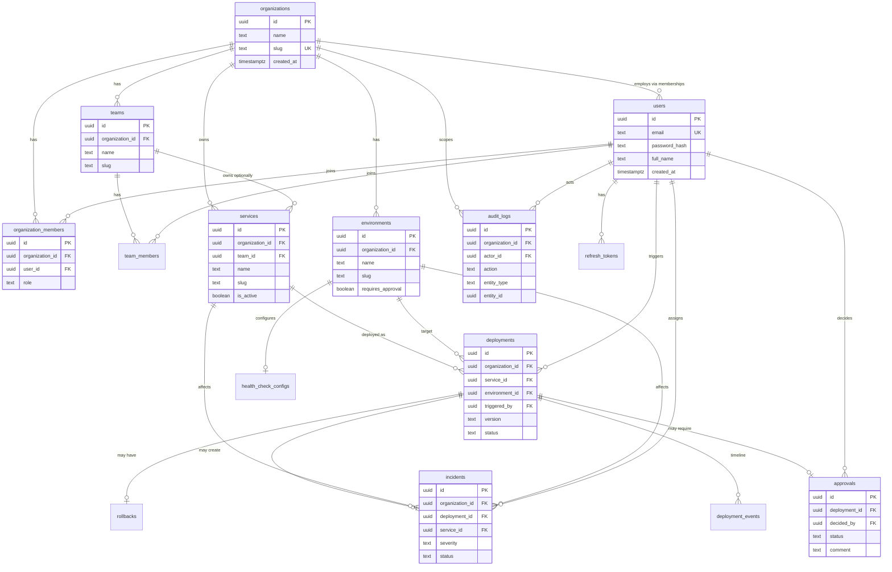

# FlowOps — Database Design

**Engine:** PostgreSQL 16+  
**Keys:** UUID primary keys (`gen_random_uuid()`)  
**ORM (planned):** Prisma  
**Conventions:** `snake_case` tables/columns · `created_at` / `updated_at` timestamptz · soft-delete only where noted

---

## 1. Design Goals

1. Normalized 3NF schema with clear tenancy (`organization_id` on owned entities).  
2. Enforce deployment state integrity in application + check constraints where practical.  
3. Indexes for list filters: org + status + created_at, FKs, unique slugs.  
4. Append-only `audit_logs` and `deployment_events` for timelines.  
5. Support seed volumes: ≥10 services, ≥50 deployments, ≥20 incidents, ≥100 audits.

---

## 2. Entity-Relationship Diagram



---

## 3. Enumerations

Prefer PostgreSQL enums or text + CHECK (Prisma enums map cleanly).

| Enum | Values |
|------|--------|
| `org_role` | `admin`, `devops`, `developer`, `release_manager`, `viewer` |
| `deployment_status` | `queued`, `building`, `testing`, `waiting_for_approval`, `deploying`, `health_check`, `success`, `failed`, `rollback_required`, `rolling_back`, `rolled_back` |
| `approval_status` | `pending`, `approved`, `rejected` |
| `incident_severity` | `sev1`, `sev2`, `sev3`, `sev4` |
| `incident_status` | `open`, `investigating`, `mitigated`, `resolved` |
| `env_slug` | `dev`, `qa`, `uat`, `prod` |

Application-layer allow-list remains the source of truth for legal **transitions**; DB stores current status only.

---

## 4. Table Definitions

### 4.1 `organizations`

| Column | Type | Constraints |
|--------|------|-------------|
| `id` | uuid | PK, default `gen_random_uuid()` |
| `name` | text | NOT NULL |
| `slug` | text | NOT NULL, UNIQUE |
| `created_at` | timestamptz | NOT NULL, default `now()` |
| `updated_at` | timestamptz | NOT NULL, default `now()` |

### 4.2 `users`

| Column | Type | Constraints |
|--------|------|-------------|
| `id` | uuid | PK |
| `email` | citext/text | NOT NULL, UNIQUE |
| `password_hash` | text | NOT NULL |
| `full_name` | text | NOT NULL |
| `is_active` | boolean | NOT NULL, default true |
| `created_at` | timestamptz | NOT NULL, default `now()` |
| `updated_at` | timestamptz | NOT NULL |

**Indexes:** unique `(email)`

### 4.3 `organization_members`

| Column | Type | Constraints |
|--------|------|-------------|
| `id` | uuid | PK |
| `organization_id` | uuid | FK → organizations ON DELETE CASCADE |
| `user_id` | uuid | FK → users ON DELETE CASCADE |
| `role` | org_role | NOT NULL |
| `created_at` | timestamptz | NOT NULL, default `now()` |

**Constraints:** UNIQUE `(organization_id, user_id)`  
**Indexes:** `(organization_id, role)`, `(user_id)`

### 4.4 `refresh_tokens`

| Column | Type | Constraints |
|--------|------|-------------|
| `id` | uuid | PK |
| `user_id` | uuid | FK → users ON DELETE CASCADE |
| `token_hash` | text | NOT NULL, UNIQUE |
| `expires_at` | timestamptz | NOT NULL |
| `revoked_at` | timestamptz | NULL |
| `created_at` | timestamptz | NOT NULL, default `now()` |

**Indexes:** `(user_id)`, `(expires_at)` WHERE `revoked_at IS NULL`

### 4.5 `teams`

| Column | Type | Constraints |
|--------|------|-------------|
| `id` | uuid | PK |
| `organization_id` | uuid | FK → organizations ON DELETE CASCADE |
| `name` | text | NOT NULL |
| `slug` | text | NOT NULL |
| `created_at` | timestamptz | NOT NULL |
| `updated_at` | timestamptz | NOT NULL |

**Constraints:** UNIQUE `(organization_id, slug)`  
**Indexes:** `(organization_id)`

### 4.6 `team_members`

| Column | Type | Constraints |
|--------|------|-------------|
| `id` | uuid | PK |
| `team_id` | uuid | FK → teams ON DELETE CASCADE |
| `user_id` | uuid | FK → users ON DELETE CASCADE |
| `created_at` | timestamptz | NOT NULL |

**Constraints:** UNIQUE `(team_id, user_id)`  
**Indexes:** `(user_id)`

### 4.7 `services`

| Column | Type | Constraints |
|--------|------|-------------|
| `id` | uuid | PK |
| `organization_id` | uuid | FK → organizations ON DELETE CASCADE |
| `team_id` | uuid | FK → teams ON DELETE SET NULL |
| `name` | text | NOT NULL |
| `slug` | text | NOT NULL |
| `description` | text | NULL |
| `repository_url` | text | NULL |
| `is_active` | boolean | NOT NULL, default true |
| `created_at` | timestamptz | NOT NULL |
| `updated_at` | timestamptz | NOT NULL |

**Constraints:** UNIQUE `(organization_id, slug)`  
**Indexes:** `(organization_id, is_active)`, `(team_id)`

### 4.8 `environments`

| Column | Type | Constraints |
|--------|------|-------------|
| `id` | uuid | PK |
| `organization_id` | uuid | FK → organizations ON DELETE CASCADE |
| `name` | text | NOT NULL |
| `slug` | text | NOT NULL |
| `requires_approval` | boolean | NOT NULL, default false |
| `sort_order` | int | NOT NULL, default 0 |
| `created_at` | timestamptz | NOT NULL |
| `updated_at` | timestamptz | NOT NULL |

**Constraints:** UNIQUE `(organization_id, slug)`  
**Indexes:** `(organization_id, sort_order)`  
**Seed rule:** `prod.requires_approval = true`

### 4.9 `health_check_configs`

| Column | Type | Constraints |
|--------|------|-------------|
| `id` | uuid | PK |
| `environment_id` | uuid | FK → environments ON DELETE CASCADE, UNIQUE |
| `endpoint_path` | text | NOT NULL, default `/health` |
| `timeout_ms` | int | NOT NULL, default 5000 |
| `success_threshold` | int | NOT NULL, default 1 |
| `failure_threshold` | int | NOT NULL, default 1 |
| `created_at` | timestamptz | NOT NULL |
| `updated_at` | timestamptz | NOT NULL |

Simulated by workers; config exists for realism and UI.

### 4.10 `deployments`

| Column | Type | Constraints |
|--------|------|-------------|
| `id` | uuid | PK |
| `organization_id` | uuid | FK → organizations ON DELETE CASCADE |
| `service_id` | uuid | FK → services ON DELETE RESTRICT |
| `environment_id` | uuid | FK → environments ON DELETE RESTRICT |
| `triggered_by` | uuid | FK → users ON DELETE RESTRICT |
| `version` | text | NOT NULL |
| `status` | deployment_status | NOT NULL, default `queued` |
| `failure_reason` | text | NULL |
| `commit_sha` | text | NULL |
| `started_at` | timestamptz | NULL |
| `finished_at` | timestamptz | NULL |
| `created_at` | timestamptz | NOT NULL |
| `updated_at` | timestamptz | NOT NULL |

**Indexes:**

- `(organization_id, created_at DESC)`
- `(organization_id, status)`
- `(service_id, created_at DESC)`
- `(environment_id, created_at DESC)`
- `(triggered_by, created_at DESC)`

### 4.11 `deployment_events`

Append-only stage timeline.

| Column | Type | Constraints |
|--------|------|-------------|
| `id` | uuid | PK |
| `deployment_id` | uuid | FK → deployments ON DELETE CASCADE |
| `from_status` | deployment_status | NULL |
| `to_status` | deployment_status | NOT NULL |
| `message` | text | NULL |
| `created_at` | timestamptz | NOT NULL, default `now()` |

**Indexes:** `(deployment_id, created_at)`

### 4.12 `approvals`

| Column | Type | Constraints |
|--------|------|-------------|
| `id` | uuid | PK |
| `deployment_id` | uuid | FK → deployments ON DELETE CASCADE, UNIQUE |
| `status` | approval_status | NOT NULL, default `pending` |
| `decided_by` | uuid | FK → users ON DELETE SET NULL |
| `comment` | text | NULL |
| `decided_at` | timestamptz | NULL |
| `created_at` | timestamptz | NOT NULL |
| `updated_at` | timestamptz | NOT NULL |

**Indexes:** `(status, created_at)` for pending queues

### 4.13 `rollbacks`

| Column | Type | Constraints |
|--------|------|-------------|
| `id` | uuid | PK |
| `deployment_id` | uuid | FK → deployments ON DELETE CASCADE, UNIQUE |
| `target_version` | text | NULL |
| `triggered_by` | uuid | FK → users ON DELETE RESTRICT |
| `status` | text | NOT NULL |
| `started_at` | timestamptz | NULL |
| `finished_at` | timestamptz | NULL |
| `created_at` | timestamptz | NOT NULL |

`deployment_id` is the **failed** deployment being rolled back; `target_version` is last known good when available.

### 4.14 `incidents`

| Column | Type | Constraints |
|--------|------|-------------|
| `id` | uuid | PK |
| `organization_id` | uuid | FK → organizations ON DELETE CASCADE |
| `deployment_id` | uuid | FK → deployments ON DELETE SET NULL |
| `service_id` | uuid | FK → services ON DELETE RESTRICT |
| `environment_id` | uuid | FK → environments ON DELETE RESTRICT |
| `title` | text | NOT NULL |
| `description` | text | NULL |
| `severity` | incident_severity | NOT NULL |
| `status` | incident_status | NOT NULL, default `open` |
| `assignee_id` | uuid | FK → users ON DELETE SET NULL |
| `opened_at` | timestamptz | NOT NULL, default `now()` |
| `resolved_at` | timestamptz | NULL |
| `created_at` | timestamptz | NOT NULL |
| `updated_at` | timestamptz | NOT NULL |

**Indexes:**

- `(organization_id, status, opened_at DESC)`
- `(organization_id, severity)`
- `(service_id, opened_at DESC)`
- `(deployment_id)` UNIQUE WHERE `deployment_id IS NOT NULL` *optional* — allow multiple only if product needs; default **one auto-incident per deployment** via unique partial index:

```sql
CREATE UNIQUE INDEX incidents_deployment_id_uidx
  ON incidents (deployment_id)
  WHERE deployment_id IS NOT NULL;
```

### 4.15 `audit_logs`

Append-only; **no updates/deletes** from application.

| Column | Type | Constraints |
|--------|------|-------------|
| `id` | uuid | PK |
| `organization_id` | uuid | FK → organizations ON DELETE CASCADE |
| `actor_id` | uuid | FK → users ON DELETE SET NULL |
| `action` | text | NOT NULL |
| `entity_type` | text | NOT NULL |
| `entity_id` | uuid | NULL |
| `metadata` | jsonb | NOT NULL, default `{}` |
| `ip_address` | inet | NULL |
| `created_at` | timestamptz | NOT NULL, default `now()` |

**Indexes:**

- `(organization_id, created_at DESC)`
- `(organization_id, action, created_at DESC)`
- `(entity_type, entity_id)`
- GIN `(metadata)` only if query patterns need it (defer)

### 4.16 `notifications` (optional M6+)

| Column | Type | Constraints |
|--------|------|-------------|
| `id` | uuid | PK |
| `organization_id` | uuid | FK |
| `user_id` | uuid | FK |
| `type` | text | NOT NULL |
| `payload` | jsonb | NOT NULL |
| `read_at` | timestamptz | NULL |
| `created_at` | timestamptz | NOT NULL |

**Indexes:** `(user_id, read_at, created_at DESC)`

---

## 5. Relationship Explanations

| Relationship | Cardinality | Why |
|--------------|-------------|-----|
| Org ↔ Members ↔ Users | M:N | Users can join multiple orgs with distinct roles |
| Org → Teams → Members | 1:N:M | Team ownership for services without duplicating users |
| Org → Services | 1:N | Tenancy boundary for all deployables |
| Team → Services | 1:N optional | Ownership / Developer scoping |
| Org → Environments | 1:N | Dev/QA/UAT/Prod per tenant |
| Service + Env → Deployments | 1:N | Many releases over time |
| Deployment → Approval | 1:0..1 | Only when approval required |
| Deployment → Events | 1:N | Immutable timeline |
| Deployment → Incident | 1:0..1 | Auto-incident on failure path |
| Deployment → Rollback | 1:0..1 | Simulated rollback record |
| Env → HealthCheckConfig | 1:1 | Per-env simulated probe settings |
| Org → AuditLogs | 1:N | Security/ops forensics |

**Referential actions**

- Cascade org deletes for demo reset simplicity (single-tenant demos).  
- `RESTRICT` on service/env delete when deployments exist — protect history.  
- `SET NULL` on optional assignee / decided_by when users leave.

---

## 6. Integrity Rules (application-enforced)

1. Deployment status transitions must match the allow-list in ARCHITECTURE.  
2. Creating a deployment in `prod` must create `approvals` row `pending` when pipeline reaches approval (or eagerly — implementation choice documented in M4).  
3. Auto-incident creation is idempotent per `deployment_id`.  
4. Refresh tokens are hashed; plaintext never stored.  
5. `audit_logs` inserted in same transaction as the mutating write when feasible.

---

## 7. Example Transition Allow-List (reference)

```
queued → building
building → testing | failed
testing → waiting_for_approval | deploying
waiting_for_approval → deploying | failed
deploying → health_check | failed
health_check → success | failed
failed → rollback_required
rollback_required → rolling_back
rolling_back → rolled_back
```

---

## 8. Migration Strategy

1. Prisma migrations versioned under `apps/api/prisma/migrations`.  
2. Seed script `prisma/seed.ts` creates Northstar Commerce org, users, ≥10 services, 4 envs, ≥50 deployments, ≥20 incidents, ≥100 audits.  
3. CI runs `prisma migrate deploy` against ephemeral Postgres.

---

## 9. Related Documents

- [PRODUCT_SPEC.md](./PRODUCT_SPEC.md)  
- [ARCHITECTURE.md](./ARCHITECTURE.md)  
- [API_SPEC.md](./API_SPEC.md)  
- [IMPLEMENTATION_PLAN.md](./IMPLEMENTATION_PLAN.md)  
