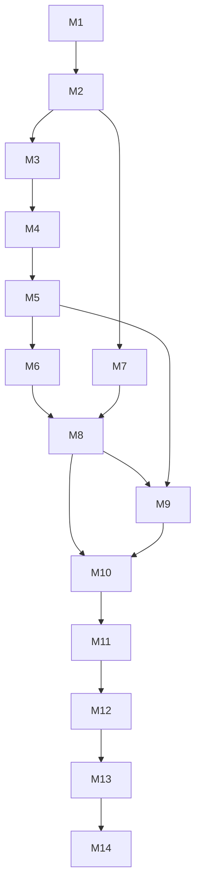

# FlowOps — Implementation Plan

Milestones **M1–M14**. Each milestone ends with: review · fix · test · lint · build · docs · status report.

> **Current:** M6 complete — WebSockets + notifications.  
> Continue with M8 when instructed.

---

## Milestone Overview

| ID | Name | Primary outcomes |
|----|------|------------------|
| **M1** | Design | Product, architecture, DB, API, plan docs |
| **M2** | API foundation | NestJS + Prisma + Auth + org membership |
| **M3** | Deploy core | Services, environments, deployments + queue skeleton |
| **M4** | Governance | Approvals + rollback simulation |
| **M5** | Resilience | Health simulation + incidents |
| **M6** | Realtime | WebSockets + notifications |
| **M7** | Angular shell | App shell, design system, auth UI |
| **M8** | Deploy UI | Dashboard + deployment flows |
| **M9** | Ops UI | Incidents + audit views |
| **M10** | Simulation | Chaos knobs + demo seed polish |
| **M11** | Testing | Jest + Playwright coverage gates |
| **M12** | Ship | Docker Compose + GitHub Actions |
| **M13** | Harden | Perf/security review |
| **M14** | Portfolio | README polish, screenshots, CONTRIBUTING/SECURITY |

---

## M1 — Architecture + Product Spec + Database Design

**Status:** Complete in this change set

### Deliverables

- [x] `docs/PRODUCT_SPEC.md`
- [x] `docs/ARCHITECTURE.md`
- [x] `docs/DATABASE_DESIGN.md` (normalized PG, UUIDs, indexes, FKs, Mermaid ERD)
- [x] `docs/API_SPEC.md`
- [x] `docs/IMPLEMENTATION_PLAN.md`
- [x] Root `README.md` portfolio overview

### Exit criteria

- Recruiter can understand problem, stack, and module boundaries from README + docs  
- ERD and state machine are internally consistent with API resources  
- No application runtime required  

### Verify

```bash
ls docs/
# open docs/PRODUCT_SPEC.md, ARCHITECTURE.md, DATABASE_DESIGN.md, API_SPEC.md, IMPLEMENTATION_PLAN.md
```

---

## M2 — NestJS Foundation + Auth + DB

**Status:** Complete

### Scope

- Monorepo or `apps/api` NestJS 11+ project structure matching ARCHITECTURE module map  
- Prisma schema from DATABASE_DESIGN; initial migration  
- Auth: register/login/refresh/logout/me; argon2; JWT guards  
- Organizations + memberships + role guard  
- Config module, validation, structured logging, health endpoints  
- `.env.example`, basic unit tests for auth  

### Exit criteria

- [x] `POST /auth/login` works against local Postgres  
- [x] Protected route rejects missing/invalid JWT and wrong role  
- [x] Migrations apply cleanly  

### Verify

```bash
cd apps/api
cp .env.example .env   # if needed
npx prisma migrate deploy
npx prisma db seed
npm run start:dev
# POST http://127.0.0.1:43124/api/v1/auth/login
# GET  http://127.0.0.1:43124/api/v1/auth/me  (Bearer token)
npm test
```

### Next dependency

Blocks M3.

---

## M3 — Services + Environments + Deployments

**Status:** Complete

### Scope

- CRUD services & environments (seed 4 envs)  
- Create deployment → `QUEUED`  
- BullMQ worker advances BUILDING → TESTING → (branch approval or deploy)  
- `deployment_events` + audit on transitions  
- List/filter/pagination  

### Exit criteria

- [x] Non-prod happy path reaches SUCCESS via workers  
- [x] Invalid transitions rejected  

### Verify

```bash
cd apps/api
npx prisma db seed
npm run start:dev
# login as jordan.blake@northstar.io / FlowOps!demo1
# select org, create deployment to dev → poll until success
# create deployment to prod → waiting_for_approval
npm test
```

### Next dependency

Blocks M4 (approval decide + rollback).

## M4 — Approval + Rollback

**Status:** Complete

### Scope

- Prod path pauses at `WAITING_FOR_APPROVAL`  
- Approval decide API + RBAC  
- Failure path → `ROLLBACK_REQUIRED` → rollback API → `ROLLED_BACK`  
- Audit all decisions  

### Exit criteria

- [x] Rejected prod deploy ends `FAILED` with audit  
- [x] Rollback simulation completes and links record  

### Also delivered

- Approval comments, history (audit + events), expiration (`expiresAt`, status `expired`)
- Approve continues pipeline via BullMQ `continue-pipeline` → SUCCESS
- Rollback targets previous successful version for same service/env

### Verify

```bash
# as release_manager avery.kim@northstar.io — POST /approvals/:id/decide
# as devops — POST /deployments/:id/rollback on a failed deploy
npm test
```

### Next dependency

Blocks M5 (health + incidents).

## M5 — Health + Incidents

**Status:** Complete

### Scope

- Health check stage + configs  
- Auto-incident on failure/health failure  
- Incident CRUD / status workflow  
- Seed ≥20 incidents  

### Exit criteria

- [x] Unhealthy simulation opens incident idempotently per deployment  

### Also delivered

- Simulated probes: api / db / redis / queue / external with latency, uptime, consecutive failures
- Auto-incidents for deploy failure, health unavailability, repeated failures, latency threshold
- Incident timeline events + status workflow open→investigating→mitigated→resolved
- Seed ≥20 incidents + health snapshots

### Verify

```bash
cd apps/api && npx prisma db seed && npm run start:dev
# GET /incidents  ·  POST /service-health/run {"forceUnhealthy":true}
# Reject a prod deploy → incident auto-created for that deploymentId
npm test
```

### Next dependency

Blocks M6 (WebSockets).

## M6 — WebSockets

**Status:** Complete

### Scope

- Gateway auth, org rooms  
- Emit deployment/approval/incident events  
- In-app notifications table + API  

### Exit criteria

- [x] Second browser session sees live status without refresh  

### Also delivered

- JWT-authenticated Socket.IO at path `/ws`
- Events: `deployment.updated`, `health.updated`, `incident.created|updated`, `approval.requested|resolved`, `rollback.started|completed`, `notification.created`
- Notifications list / mark-read / mark-all-read

### Verify

```bash
# connect with socket.io-client path /ws auth.token=<accessToken>
# emit join { orgId } then create a deployment — observe deployment.updated
npm test
```

### Next dependency

Blocks M7 (Angular shell).

## M7 — Angular + Design System

**Status:** Complete

### Scope

- Angular 20+ app, routing, auth interceptor  
- Dark-first design tokens (original, DevOps aesthetic)  
- Layout: nav, org switcher, simulation banner  
- Shared UI primitives (tables, status chips, dialogs) — prefer lightweight internal kit; add Angular Material or CDK only if needed  

### Exit criteria

- [x] Login + empty dashboard shell against API  

### Also delivered

- `apps/web` Angular 20 + Tailwind 4 + Angular CDK (`BreakpointObserver`)
- Auth login/logout/refresh interceptor with Signals session state
- Shell routes: dashboard, deployments, services, environments, incidents, approvals, health, audit
- Primitives: `fo-status-badge`, `fo-data-table`, `fo-page-header`, `fo-empty-state`
- Env-driven `apiBaseUrl` (`http://127.0.0.1:43124/api/v1`), serve on port **43125**

### Verify

```bash
cd apps/api && npm run start:dev
cd apps/web && npm start
# open http://127.0.0.1:43125 — sign in with seed account
npm test && npm run build
```

### Next dependency

Blocks M8 (dashboard + deployment UI).

## M8 — Dashboard + Deployment UI

### Scope

- Ops dashboard: recent deploys, pending approvals, open incidents  
- Deployment list + detail timeline  
- Create deployment wizard  

### Exit criteria

- Full non-prod flow operable from UI  

---

## M9 — Incidents + Audit UI

### Scope

- Incident list/detail/update  
- Audit log explorer with filters  
- Approval inbox UI  

### Exit criteria

- Release Manager can approve prod from UI; Viewer can read audit  

---

## M10 — Simulation Engine

### Scope

- Org-level fail rates / delays  
- Deterministic mode  
- Chaos burst + seed realism (≥50 deploys, ≥100 audits, ≥10 services)  
- Clear Simulation Mode copy everywhere  

### Exit criteria

- Fresh Compose seed meets product counts  

---

## M11 — Testing

### Scope

- Jest: domain state machine, auth, RBAC  
- e2e API tests  
- Playwright: login, deploy, approve, incident  
- Coverage thresholds documented  

### Exit criteria

- CI-equivalent local test scripts green  

---

## M12 — Docker + CI/CD

### Scope

- Multi-stage Dockerfiles for api/web/worker  
- `docker compose up --build` one-command demo with seed  
- GitHub Actions: lint, test, build  
- Issue/PR templates  

### Exit criteria

- Cold machine can demo from README instructions alone  

---

## M13 — Perf / Security Review

### Scope

- Index verification / explain slow lists  
- Rate limits, security headers, secret scan  
- Load smoke on list endpoints  
- Fix critical findings  

### Exit criteria

- Short SECURITY.md notes + checklist completed  

---

## M14 — Portfolio Polish

### Scope

- README screenshots/GIFs  
- CONTRIBUTING.md, SECURITY.md, API link summary  
- Final copy edit; ensure no “lorem” / “Test User”  
- Record architecture decision log if any drifts  

### Exit criteria

- Recruiter-ready GitHub landing experience  

---

## Cross-Cutting Rules (every milestone)

1. Conventional commits (`feat:`, `docs:`, `fix:`, `test:`, `chore:`)  
2. No secrets in git  
3. Controllers thin; validation at boundary  
4. Update docs when behavior drifts from M1 specs  
5. Report: completed functionality · files · decisions · tests · verify commands · limitations · next milestone  

---

## Suggested Sequencing Dependency Graph



---

## Related Documents

- [PRODUCT_SPEC.md](./PRODUCT_SPEC.md)  
- [ARCHITECTURE.md](./ARCHITECTURE.md)  
- [DATABASE_DESIGN.md](./DATABASE_DESIGN.md)  
- [API_SPEC.md](./API_SPEC.md)  
